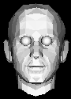
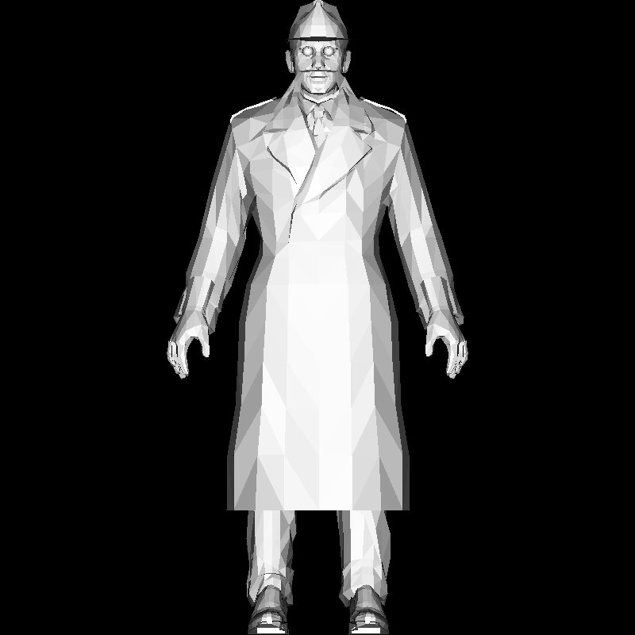

# swrenderer

[wip] a software renderer from scratch

builds a renderer with no graphics libraries - just linear algebra and pixel pushing.
also tries explaining the seldom unintuitive mathematical backbone for graphics along the way. 

follows [tinyrenderer](https://github.com/ssloy/tinyrenderer) loosely but with cleaner c++20 and extra implementations where the math turns interesting.

**usage:**

```console
$ make
$ ./swrenderer obj/boggie/head.obj ./obj/boggie/eyes.obj ./obj/floor.obj ./obj/boggie/body.obj
```

**renders:**

| wireframe | flat shading <br />(via edge, barycentric or scanline) |
|-----------|--------------|
|  |  |

